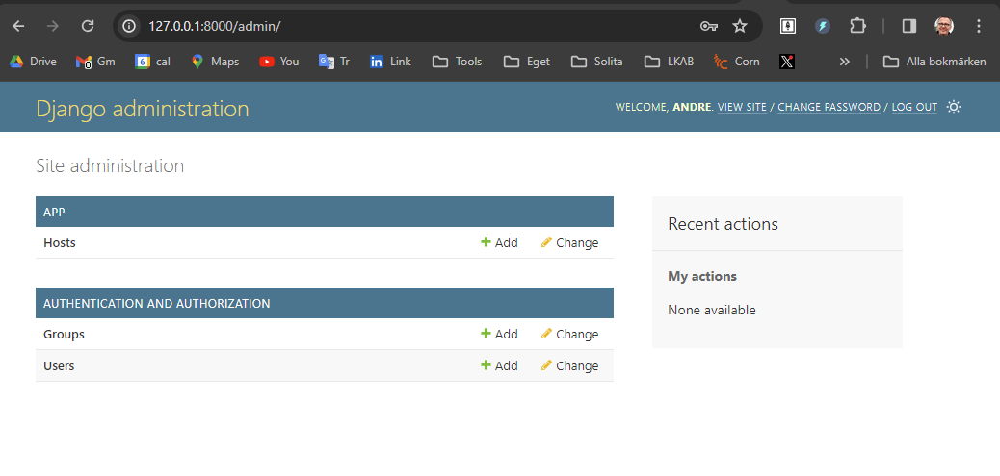
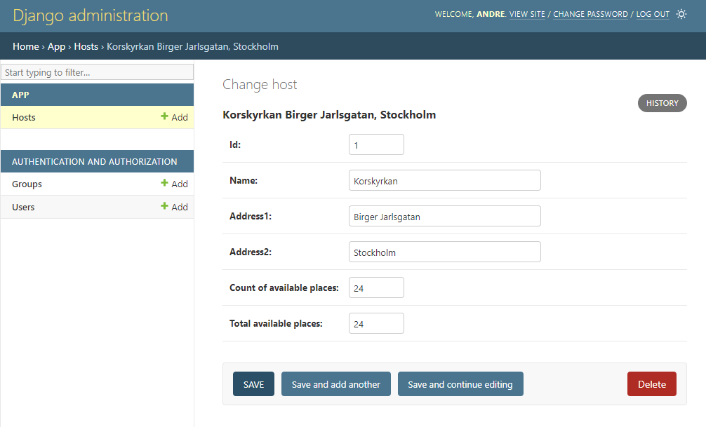
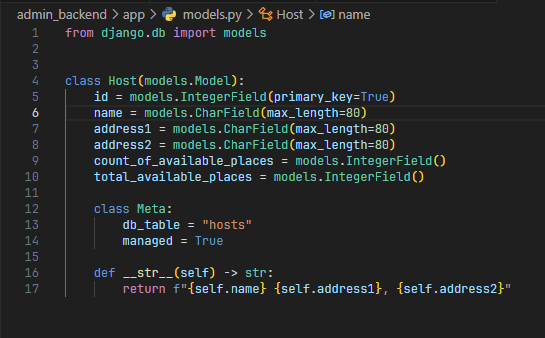

# Admin i NoQ
Grunden finns i denna video: https://www.youtube.com/watch?v=XqkqbsdtoMI

## Installation
Allt gås igenom i videon, men här är alla kommandon:

1. Installera python
```
    python --version eller python3 --version på Mac
    
```
2. Installera nödvändiga bibliotek
```
    pip install django django-ninja django-extensions
```
3. Skapa databas (valfritt)
```
    Navigera till biblioteket som innehåller manage.py
    python manage.py makemigrations
    python manage.py migrate
```

```
    Skapa superuser admin
    python manage.py createsuperuser
```
4. Starta webbservern
```
    python manage.py runserver
```
5. Ange http://127.0.0.1:8000/admin i webbläsaren

## Översikt admin UI

## Detaljbild hosts


## Programkod
Django framework innehåller så mycket standardfunktionalitet. Detta är i stort sett allt som krävs för hosts-tabellen ovan.



För mer info se Django tutorial: https://docs.djangoproject.com/en/5.0/intro/tutorial01/